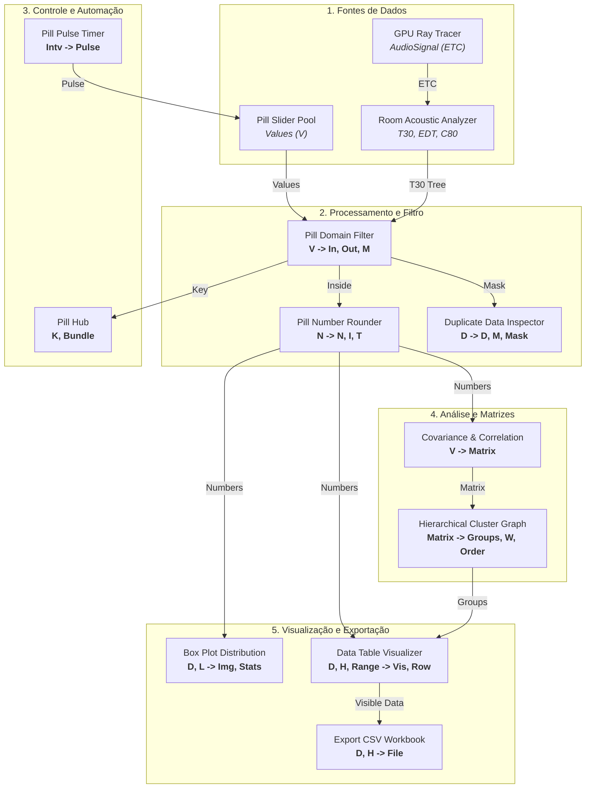

# 🔗 Contratos de Conexão e Nomenclatura de Parâmetros

Este documento estabelece o **padrão universal de nomenclatura, tipos, apelidos (nicknames) e descrições de parâmetros** para a suíte **Glaux / Buraqueira**.

Sempre que uma nova pilha (Pill), componente de análise, solver acústico ou visualizador for concebido no Obsidian ou implementado em C#, ele **deve** seguir as definições desta matriz para assegurar interoperabilidade plug-and-play imediata no Grasshopper.

---

## 🎯 Por que Padronizar Parâmetros?

No Grasshopper, a experiência do usuário e a robustez dos fluxos paramétricos dependem de componentes que "conversam a mesma língua":
1. **Reutilização de Cabos e Fios:** Se um componente emite `Inside` (`In`) e o próximo espera `Values` (`V`), o fluxo é intuitivo e direto.
2. **Compatibilidade com DataTrees:** Nomes e tipos consistentes evitam erros de conversão implícita ou descarte de ramos estruturais.
3. **Transmissão Sem Fio (PillHub):** Pilhas que publicam ou assinam canais com o mesmo tipo e semântica integram-se automaticamente.

---

## 📊 1. Matriz Canônica de Parâmetros

A tabela abaixo define os contratos obrigatórios de nomenclatura:

### A. Dados Numéricos & Coleções

| Parâmetro Canônico | Nick | Acesso (Access) | Tipo C# / Goo | Descrição Padronizada |
| :--- | :---: | :---: | :--- | :--- |
| **Values** | `V` | `Tree` ou `List` | `Generic` / `double` | Valores numéricos, listas ou árvore completa (`DataTree`) a inspecionar, transformar ou calcular. |
| **Data** | `D` | `Tree` | `Generic` | Matriz tabular de dados em árvore, onde cada ramo (`branch`) representa uma coluna/grupo independente. |
| **Numbers** | `N` | `Tree` | `Number` (`double`) | Valores numéricos reais nativos processados para cálculos subsequentes. |
| **Integers** | `I` | `Tree` | `Integer` (`int`) | Índices ordinais ou valores inteiros discretizados. |
| **Text** | `T` | `Tree` | `Text` (`string`) | Valores formatados como texto, preservando zeros à direita e formato decimal configurado. |
| **Headers** | `H` | `List` | `Text` | Rótulos ou nomes textuais das colunas/séries de dados. Se omitido, gera nomes automáticos baseados nos caminhos. |
| **Labels** | `L` | `List` | `Text` | Rótulos de identificação dos nós, receptores ou categorias no eixo correspondente. |

---

### B. Filtragem, Domínio & Recorte (Pill Filters)

| Parâmetro Canônico | Nick | Acesso | Tipo C# / Goo | Descrição Padronizada |
| :--- | :---: | :---: | :--- | :--- |
| **Domain** | `D` | `Item` | `Generic` (`Interval`) | Domínio ou intervalo numérico aceitável $[Min \text{ To } Max]$ (ex: `'100 To 250'`). |
| **Row Range** | `Range` | `Item` | `Generic` | Intervalo de linhas ou fatias a processar (aceita `Interval`, texto `'10..30'` ou índice inicial). |
| **Min** | `Min` | `Item` | `Number` | Limite inferior do intervalo (opcional, sobrescreve ou inicia o domínio). |
| **Max** | `Max` | `Item` | `Number` | Limite superior do intervalo (opcional, sobrescreve ou encerra o domínio). |
| **Inclusive** | `Inc` | `Item` | `Boolean` | Se `True` (padrão), limites são fechados ($Min \le V \le Max$). Se `False`, abertos. |
| **Inside** | `In` | `Tree` | `Number` | Valores numéricos reais que atendem ao critério (estão dentro do domínio). |
| **Outside** | `Out` | `Tree` | `Number` | Valores numéricos descartados (que ficaram fora do domínio). |
| **Mask** | `M` | `Tree` | `Boolean` | Máscara booleana paralela (`True` = Aprovado, `False` = Rejeitado) para `Cull Pattern`. |
| **Indices** | `I` | `Tree` | `Integer` | Índices originais dos itens aprovados na coleção de entrada. |
| **Count** | `C` | `Item` | `Integer` | Quantidade total de elementos processados ou aprovados. |

---

### C. Sistema Pill: Triggers, Relógios & Sinais Sem Fio

| Parâmetro Canônico | Nick | Acesso | Tipo C# / Goo | Descrição Padronizada |
| :--- | :---: | :---: | :--- | :--- |
| **Key** | `K` | `Item` | `Text` | Nome identificador do canal Pill para transmissão e roteamento sem fio via [[Pill Hub]]. |
| **Active** | `On` / `Active` | `Item` | `Boolean` | Liga ou pausa o processamento do componente (`True` = Ativo/Rodando, `False` = Pausado/Pass-through). |
| **Trigger Now** | `Trig` | `Item` | `Boolean` | Disparo manual imediato: envie `True` (ou botão instantâneo) para forçar a execução. |
| **Reset** | `Rst` | `Item` | `Boolean` | Reseta contadores internos ($N=0$), cronômetros ou buffers acumulados. |
| **Interval** | `Intv` | `Item` | `Number` | Intervalo de tempo em segundos entre ciclos periódicos de disparo (ex: `1.0`, `0.5`, `5.0`). |
| **Pulse** | `Pulse` | `Item` | `Boolean` | Sinal de pulso momentâneo (`True` transitório por $X$ ms, retornando a `False` automaticamente). |
| **Cycle Count** | `N` | `Item` | `Integer` | Contagem total de ciclos ou pulsos disparados desde a inicialização. |
| **Bundle** | `Bundle` | `Item` | `Generic` (`PillBundle`) | Pacote de dados multi-parâmetro encapsulado em cabo único. |

---

### D. Álgebra Linear, Matrizes & Agrupamento (Clusters)

| Parâmetro Canônico | Nick | Acesso | Tipo C# / Goo | Descrição Padronizada |
| :--- | :---: | :---: | :--- | :--- |
| **Correlation Matrix** | `Matrix` | `List`/`Tree` | `Number` | Matriz de correlação ou similaridade $N \times N$ em lista plana row-major ou DataTree de $N$ ramos. |
| **Matrix** | `M` | `List`/`Tree` | `Number` | Matriz numérica genérica $M \times N$. |
| **N (Size)** | `N` | `Item` | `Integer` | Dimensão $N$ da matriz quadrada quando fornecida em lista plana. |
| **Groups** / **Assignments** | `Groups` | `List` | `Integer` | Índice do grupo ou cluster atribuído a cada receptor/item na ordem original. |
| **Weights** | `W` | `List` | `Number` | Pesos normalizados atribuídos a cada item com base na paridade de risco/grupo. |
| **Order** | `Order` | `List` | `Integer` | Permutação ótima das folhas/itens resultante de reordenamento hierárquico. |

---

### E. Acústica & Simulação Física

| Parâmetro Canônico | Nick | Acesso | Tipo C# / Goo | Descrição Padronizada |
| :--- | :---: | :---: | :--- | :--- |
| **Energy-Time Curve** | `ETC` | `Item` | `Generic` (`AudioSignal`) | Curva de Energia-Tempo multibanda ([[AudioSignal]]) vinda de simulação ou medição. |
| **Scene** | `Scene` | `Item` | `Generic` (`AcousticScene`) | Cena acústica completa consolidando geometria, fontes, receptores e ar. |
| **Material** | `Mat` | `Item` | `Generic` (`AcousticMaterial`) | Material com coeficientes de absorção ($\alpha$) e espalhamento ($s$) por oitava. |
| **Surface** | `Srf` | `Item`/`List` | `Generic` (`AcousticSurface`) | Superfície acústica com malha associada e material atribuído. |
| **EDT (s)** | `EDT` | `List` | `Number` | Early Decay Time (0 a -10 dB extrapolado) por banda de frequência. |
| **T30 (s)** | `T30` | `List` | `Number` | Tempo de reverberação $T_{30}$ (-5 a -35 dB) por banda de oitava. |
| **C80 (dB)** | `C80` | `List` | `Number` | Clareza musical de 80 ms conforme ISO 3382. |

---

### F. Visualizadores & Exportação (Canvas / PNG)

| Parâmetro Canônico | Nick | Acesso | Tipo C# / Goo | Descrição Padronizada |
| :--- | :---: | :---: | :--- | :--- |
| **Title** | `Title` / `T` | `Item` | `Text` | Título principal renderizado no cabeçalho do componente no canvas. |
| **Subtitle** | `Sub` | `Item` | `Text` | Subtítulo com detalhes do método, modelo ou parâmetros da análise. |
| **Y Label** | `YLab` | `Item` | `Text` | Rótulo do eixo vertical com indicação de grandeza e unidade. |
| **X Label** | `XLab` | `Item` | `Text` | Rótulo do eixo horizontal com categorias ou bandas de frequência. |
| **Visible Data** | `Vis` | `Tree` | `Generic` | Subconjunto de dados atualmente em exibição na janela/intervalo visível. |
| **Selected Row** | `Row` | `List` | `Text` | Lista com os valores de todas as colunas da linha destacada/selecionada. |
| **Export Folder** | `Folder` | `Item` | `Text` | Pasta de destino para gravação de imagens PNG de alta resolução. |
| **Save Image** | `Save` | `Item` | `Boolean` | Gatilho booleano para exportar o arquivo PNG em alta resolução (300 DPI). |
| **Saved Path** | `Path` / `PNG` | `Item` | `Text` | Caminho absoluto do arquivo gravado com sucesso no disco. |
| **View / Viewport** | `View` / `V` | `Item` | `Text` | Nome do Viewport do Rhino configurado ou a ser capturado ('Perspective', 'Top', etc.). |
| **Active Name** | `ActiveName` / `AName` | `Item` | `Text` | Nome padronizado de arquivo emitido pelo [[Pill View Generator]] para a entrada `Name` do [[Pill Viewport 3D Capture]]. |
| **Active Title** | `ActiveTitle` / `ATtl` | `Item` | `Text` | Título editorial formatado emitido pelo [[Pill View Generator]] para a entrada `Ttl` do [[Pill Viewport 3D Capture]]. |
| **Bounding Box** | `BBox` / `B` | `List` | `Generic` | Caixa delimitadora ou geometrias para cálculo e enquadramento automático de câmera. |
| **Model Direction** | `Dir` / `D` | `Item` | `Vector` | Vetor horizontal de orientação da frente do modelo arquitetônico/estrutural. |
| **Active Index** | `Index` / `Idx` | `Item` | `Integer` | Índice da vista selecionada para transição e captura sequencial automatizada. |

---

## 🏗️ 2. Regras para Gerar Novas Pilhas (Pills)

Ao criar uma nova pilha ou componente que precise manipular dados da suíte, siga rigorosamente este roteiro:

1. **Reutilize os Nomes Canônicos:**
   - Se sua pilha filtra valores, a entrada **deve** se chamar `Values` (`V`) e a saída principal `Inside` (`In`).
   - Se aceita um intervalo, o parâmetro **deve** se chamar `Domain` (`D`) ou aceitar `Min` e `Max`.
2. **Exponha Máscara Booleana (`Mask` / `M`):**
   - Qualquer componente que filtre ou selecione elementos de uma lista ou árvore deve expor uma saída `Mask` de booleanos, permitindo ligação imediata em componentes nativos do Grasshopper como `Cull Pattern`, `Dispatch` ou `Pick'n'Choose`.
3. **Mantenha Estrutura de Árvore (`DataTree`):**
   - Sempre utilize `GH_Structure<T>` ou `DataTree<T>` para não aplanar os dados de usuários que trabalham com múltiplos ramos (ex: múltiplos auditórios ou múltiplas fontes simultâneas).
4. **Adicione Suporte ao PillHub (`Key` / `K`):**
   - Inclua um parâmetro opcional `Key` (`K`). Se preenchido, o componente publica automaticamente sua saída no [[Pill Hub]] sob a categoria correspondente (`[NUM]`, `[GEO]`, `[TXT]`, `[STAT]`).
5. **Cápsula Visual Pill:**
   - Implemente `CreateAttributes()` herdando de `Pill_Attributes` para exibir badge de categoria, contadores dinâmicos de dados e botões de ação rápida no Canvas.

---

## 🔄 3. Diagrama de Fluxo de Parâmetros Interligados

## Glaux Urb — perfil transversal semântico (2026-10-01)

| Escopo | Nome | Nickname | Tipo/contrato |
|---|---|---|---|
| Via inteira | Street | Street | Texto, ID/nome da via |
| Via inteira | Street Type | StreetType | Texto, classificação global |
| Faixa individual | Nome do Element Type | Tipo + seta direcional | Input genérico variável; intervalo GH, `MinimumWidth|MaximumWidth` ou número fixo |
| Saída | Street Profile | Profile | `StreetProfile { Street, StreetType, Elements[] }` |

Cada `StreetProfileElement` inclui `Id`, `ElementType`, `Direction`, `Required` e `WidthDomain [Minimum,Maximum]`. O `ElementType` pertence ao parâmetro que representa a faixa; não há lista externa de tipos sincronizada por índices. `Street Type` pode produzir `PROFILE_TYPE_MISMATCH` sem modificar `Elements[]`. A conexão preferida é `Profiled` → `Axis` → `Sections` (`ProfiledSection` por `{rua;estaca}`) → `Street Profile Fitting`, sem novo matching. `SectionMeta` e `PathIdx` são pontes de compatibilidade; índice é posição temporária, nunca identidade.

## Glaux Urb — atributos GIS comuns (1.2.0)

| Nome | Nickname | Tipo/contrato |
|---|---|---|
| Field Names | Fields | Lista ordenada de nomes das colunas GIS. |
| Attributes | Values | Árvore genérica `{feição}`; item `i` é o valor de `Fields[i]`, sem prefixo do nome. |
| Geometry by Feature | Geometry | Árvore genérica com o mesmo caminho `{feição}`, inclusive multipartes. |
| GIS Features | Features | Lista `ShpFeature` com `GetAttribute(nome)`, aceita por `Street Profile Assignment.Streets`. |
| Attributes Tree | Attrs | Árvore textual `Campo: Valor`, apenas para compatibilidade. |

SHP e GPKG usam a mesma orientação por feição. O objeto tipado fornece o atributo por nome para operações críticas; `Fields` + `Values` são a interface visual do Grasshopper. NULL é o sentinela `GisNullValue`, diferente de string vazia. `Encoding`/`EncInfo` existem só no SHP.
