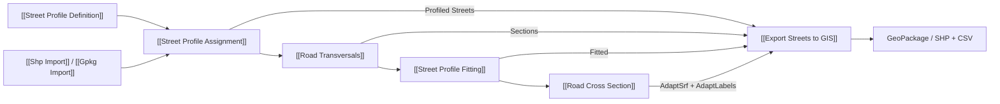

# Export Streets to GIS

Escreve GeoPackage com via semântica 1:N feições GIS, perfis dinâmicos 1:N elementos, eixos, seções ajustadas e superfícies adaptativas disponíveis. O SHP de compatibilidade sai como pasta com camadas espaciais e CSV relacionais. Não gera geometria ausente. O GeoPackage é escrito primeiro em temporário, em transação SQLite, validado e movido ao destino. `Export` só dispara na transição False → True.

## Inputs

| Nome | Nick | Tipo | Função |
|---|---|---|---|
| Profiled Streets | Streets | ProfiledStreet list | Eixos, identidade de feição, atributos e perfil nominal de [[Street Profile Assignment]] |
| Profiled Sections | Sections | ProfiledSection tree | Identidade por seção de [[Road Transversals]]; opcional |
| Fitted Street Profiles | Fitted | StreetProfile tree | Larguras reais em cada seção, no mesmo path de `Sections`; opcional |
| Adaptive Road Elements | AdaptSrf | Brep tree | Superfícies abertas 2.5D de [[Road Cross Section]]; opcional |
| Adaptive Element Labels | AdaptLabels | Text tree | `ElementID` correspondente a `AdaptSrf`; exigido quando há superfícies |
| File Path | Path | Text | Destino `.gpkg` ou nome-base `.shp` (gera pasta `<nome>_shp`) |
| EPSG | EPSG | Integer | CRS confirmado das coordenadas atuais |
| CRS Definition | WKT | Text | WKT ou caminho `.prj` do mesmo CRS |
| Width Unit | Unit | Text | Unidade confirmada das coordenadas e larguras |
| Format | Format | Text | `GPKG` (padrão) ou `SHP` |
| Overwrite | Overwrite | Boolean | Autoriza substituir arquivo existente |
| Export | Export | Boolean | Borda False → True; último input |

## Outputs

| Nome | Nick | Tipo | Função |
|---|---|---|---|
| Success | Success | Boolean | Gravação e validação concluídas nesta ativação |
| File | File | Text | Arquivo gerado |
| Report | Report | Text | Contagens, CRS, unidade, avisos e resultado |

## 🔗 Conexões & Compatibilidade de Pilhas (Pills)

## Esquema e limites

- `streets`: uma linha por nome normalizado + tipo + assinatura de perfil; StreetID semântico é hash estável desses valores.
- `street_centerlines`: uma feição por segmento, com StreetID semântico, FeatureID do `ProfiledStreet`, SourceID, cenário `EXISTING` e geometria 3D.
- `street_profile_elements`: uma linha por elemento nominal, com `ElementOrder`, `ElementID`, `MinWidth`, `MaxWidth`, `IsFixed`, direção e obrigatoriedade. A quantidade de elementos não altera o esquema.
- `street_sections` e `street_section_elements`: criadas quando existem `Sections` e `Fitted` compatíveis; `ActualWidth` vem de `FittedWidth` e não sobrescreve domínios nominais.
- `street_element_surfaces`: criada somente quando existem `AdaptSrf` e `AdaptLabels` correspondentes. O rótulo com `ElementID` determina `ElementOrder`; o índice reduzido do ramo `AdaptSrf` não é usado como ordem nominal.
- O exportador não reprojeta. EPSG, WKT e unidade devem descrever as coordenadas realmente presentes no Rhino. Curvas NURBS são discretizadas para WKB em segmentos; os eixos polilinha mantêm seus vértices.
- SHP de compatibilidade grava `street_centerlines.shp`, `street_element_surfaces.shp` quando houver superfícies, arquivos `.shx/.dbf/.prj/.cpg` e CSVs relacionais. Campos DBF são abreviados e limitados a 120 bytes UTF-8 por valor; valores maiores falham claramente. GeoPackage continua sendo a representação principal e mais completa. Limites de lote, calçadas externas e interseções ainda não têm saída longitudinal tipada completa no fluxo atual.
- Runtime Grasshopper ainda não validado. Testes isolados de SQLite não substituem abrir o componente no Rhino.
