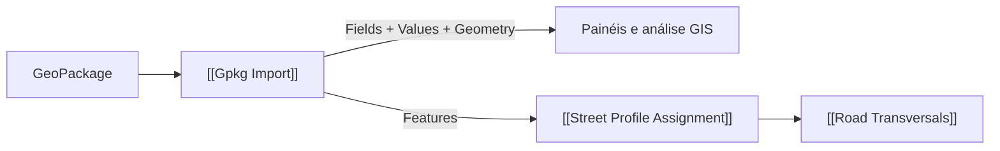

# Import GeoPackage

Importa a primeira camada de feições ou uma camada indicada por `Layer`. `Fields` é o schema e `Attributes` (`Values`) a árvore limpa, tipada e alinhada por `{feição}`. A leitura SQLite usa UTF-8; não existe controle de encoding DBF nesta pilha.

## Inputs

| Nome | Nick | Tipo | Função |
|---|---|---|---|
| File Path | Path | Text | Caminho `.gpkg`. |
| Layer Name | Layer | Text | Camada opcional. |
| Filter Query | Filter | Text | Filtro opcional por conteúdo. |
| Run | Run | Boolean | Executa. |

## Outputs

| Nome | Nick | Tipo | Função |
|---|---|---|---|
| Curves | Crv | Curve list | Curvas achatadas legadas. |
| Surfaces | Srf | Brep list | Superfícies achatadas legadas. |
| Points | Pts | Point list | Pontos achatados legados. |
| Field Names | Fields | Text list | Schema ordenado. |
| Attributes Tree | Attrs | Text tree | `Campo: Valor` para compatibilidade. |
| Available Layers | Layers | Text list | Camadas disponíveis. |
| Attributes | Values | Generic tree | Valores tipados por `{feição}` na ordem de Fields. |
| Geometry by Feature | Geometry | Generic tree | Geometrias pelo mesmo caminho. |
| GIS Features | Features | Generic list | Feições com `GetAttribute(nome)`. |
| CRS | CRS | Text | SRS ID da camada. |

## 🔗 Conexões & Compatibilidade de Pilhas (Pills)

Os outputs anteriores permanecem nos mesmos índices. NULL usa `GisNullValue`; números e texto mantêm o tipo fornecido pelo SQLite. Consulte `docs/GLAUX_URB_GIS_IMPORT_PROFILE_FITTING_2026-10-01.md`.
