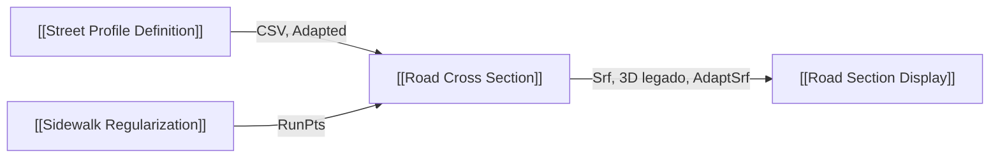

# Road Cross Section (CSV)

Mantém as pranchas de seção CSV e o sweep constante legado. A entrada `RunPts` com `Adapted` acrescenta superfícies semânticas por run, adaptadas às seções reais e separadas por faixa/canteiro/área pedonal. O sweep constante é desativado quando o modo adaptativo está ativo.

## Inputs

| Nome | Nick | Tipo | Função |
|---|---|---|---|
| CSV / Table | CSV | Text/Generic | Catálogo nominal |
| One Way | 1Way | Boolean | Caimento/sentido do catálogo |
| Median Width | Median | Number | Canteiro no catálogo |
| Alignment Axis | Axis | Curve | Sweep legado de perfil constante |
| Origin Plane | Pln | Plane | Plano da prancha |
| Default Bombeo | Slope | Number | Caimento transversal |
| Layer Depths | Layers | Text | Espessuras do catálogo |
| Curb Profile | Curb | Text | Largura/altura de meio-fio e sarjeta |
| Layout Grid | Grid | Text | Distribuição da prancha |
| Draw Annotations | Anno | Boolean | Cotas e hachuras |
| Custom Labels | Labels | Text | Rótulos da prancha |
| Run Section Points | RunPts | Point tree | Cinco pontos `{rua;run;estaca}` |
| Adapted Profiles | Adapted | Text tree | Elementos dimensionados `{rua;estaca}` |
| Run | Run | Boolean | Executa; última entrada |

## Outputs

| Nome | Nick | Tipo | Função |
|---|---|---|---|
| Section Curves | Crv | Curve list | Contornos nominais |
| Section Surfaces | Srf | Brep tree | Camadas nominais 2D |
| Road 3D | 3D | Brep tree | Sweep rígido legado; vazio no modo adaptativo |
| Annotations | Anno | Geometry list | Cotas/rótulos |
| Key Points | Pts | Point list | Pontos do catálogo |
| Quantities Report | Info | Text | Quantitativos nominais |
| Hatch Curves | Hatch | Curve list | Hachuras vetoriais |
| Adaptive Road Elements | AdaptSrf | Brep tree | Superfícies por `{rua;run;elemento}` |
| Adaptive Element Labels | AdaptLabels | Text tree | Identidade da superfície |
| Adaptive Report | AdaptInfo | Text | Runs, seções, superfícies, conflitos e tempo |

Pedonal gera uma área única sem pista/canteiro/calçadas fictícias. O canteiro é uma geometria própria da camada 6 e não um meio-fio externo. O perfil adaptativo atual cria superfícies abertas 2,5D, não sólidos de pavimento/volumes nem interseções.

## 🔗 Conexões & Compatibilidade de Pilhas (Pills)

Consulte [[05 - Contratos de Conexão e Nomenclatura de Parâmetros]] e [[GLAUX URB — ROAD PROFILE SYSTEM]].
