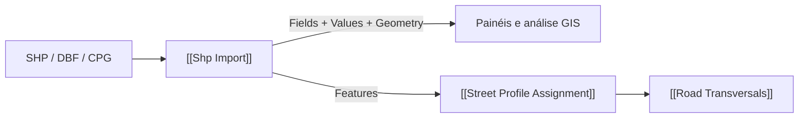

# Import Shapefile

Importa SHP/DBF preservando `Fields` como schema e emitindo `Attributes` (`Values`) tipados e limpos por `{feição}`. `Values[{feição}][i]` corresponde a `Fields[i]`; `Geometry by Feature` usa o mesmo caminho. O objeto `Features` mantém `GetAttribute(nome)` para a associação viária. `Attrs` textual `Campo: Valor` continua como legado.

## Inputs

| Nome | Nick | Tipo | Função |
|---|---|---|---|
| File Path | Path | Text | Caminho `.shp`. |
| Filter Query | Filter | Text | Filtro opcional por conteúdo dos atributos. |
| Encoding | Encoding | Text | `Auto`, `.cpg`/LDID/fallback declarado, ou override manual como UTF-8/Windows-1252. |
| Run | Run | Boolean | Executa; último input. |

## Outputs

| Nome | Nick | Tipo | Função |
|---|---|---|---|
| Curves | Crv | Curve list | Curvas achatadas legadas. |
| Surfaces | Srf | Brep list | Superfícies achatadas legadas. |
| Points | Pts | Point list | Pontos achatados legados. |
| Field Names | Fields | Text list | Nomes de campos ordenados. |
| Attributes Tree | Attrs | Text tree | `Campo: Valor` por feição, para compatibilidade. |
| Attributes | Values | Generic tree | Apenas valores tipados por `{feição}`; NULL = `GisNullValue`. |
| Geometry by Feature | Geometry | Generic tree | Geometrias por `{feição}`, alinhadas a `Values`. |
| GIS Features | Features | Generic list | Feições com atributos consultáveis por nome. |
| CRS | CRS | Text | WKT `.prj` ou indicação de ausência. |
| Encoding Info | EncInfo | Text | Encoding efetivo e sua fonte. |

## 🔗 Conexões & Compatibilidade de Pilhas (Pills)

O input `Run` passou de índice 2 para 3 ao acrescentar `Encoding`; revisar fios em arquivos `.gh` anteriores. O `.cpg` prevalece sobre LDID, e override manual prevalece sobre ambos. Fallback Windows-1252 é declarado `Default (unverified)`. Consulte `docs/GLAUX_URB_GIS_IMPORT_PROFILE_FITTING_2026-10-01.md`.
