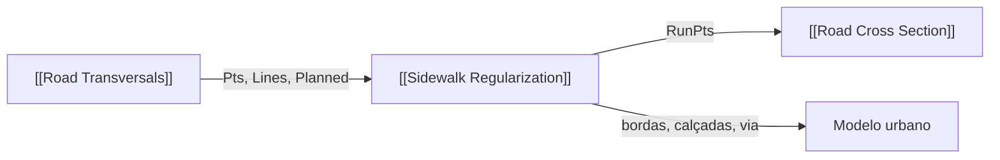

# Sidewalk Regularization

O nome e o GUID são mantidos para os arquivos GH existentes. No caminho principal, recebe seções válidas de [[Road Transversals]] e reconstrói limites e superfícies longitudinalmente; não cria novas transversais, não faz matching com SHPs nem repete a regularização dimensional. Nome futuro recomendado após migração de definições: **Street Surface Builder**.

## Inputs

| Nome | Nick | Tipo | Função |
|---|---|---|---|
| Street Axis | Axis | Curve | Eixo para o caminho legado |
| Block Boundary | Blocks | Curve list | Quadras originais para caminho legado |
| Street Boundary | Curbs | Curve list | Limites viários para caminho legado |
| Mode | Mode | Integer | Existing/Planning no caminho legado |
| Minimum Width Left | MinL | Number | Mínimo legado |
| Minimum Width Right | MinR | Number | Mínimo legado |
| Sampling Step | Step | Number | Passo legado |
| Alignment Tolerance | Tol | Number | Tolerância legado |
| Maximum Displacement | MaxD | Number | Limite legado |
| Street Name | Name | Text | Rótulo legado |
| Section Points | Pts | Point tree | Cinco pontos por `{rua;estaca}`; ativa caminho longitudinal |
| Valid Transversals | Lines | Curve tree | Confere identidade dos cortes |
| Planned Transversals | Planned | Curve tree | Entrada legada mantida, sem mover lote |
| Fitted Section Points | FitPts | Point tree | Cinco pontos ajustados por [[Street Profile Definition]] |
| Run | Run | Boolean | Executa; última entrada |

## Outputs

| Nome | Nick | Tipo | Função |
|---|---|---|---|
| Original Axis | Axis | Curve | Eixo do caminho legado |
| Original Street Boundary | Curbs | Curve list | Limites viários legados |
| Existing Block Boundary | Blocks | Curve list | Limites privados legados |
| Regularized Boundary | Reg | Curve list | Bordas propostas |
| Existing Sidewalk | Exist | Brep list | Faixas existentes |
| Proposed Sidewalk | Prop | Brep list | Faixas propostas |
| Intervention Area | Area | Brep list | Faixa de intervenção do caminho legado |
| Width Analysis | Widths | Text list | Análise do caminho legado |
| Conflict Points | Conf | Point list | Trechos isolados/sem continuidade |
| Report | Report | Text | Contagens, tempo e limites |
| Existing Block Edges | ExistEdge | Curve tree | Bordas privadas existentes `{rua;run;lado}` |
| Planned Block Edges | PlanEdge | Curve tree | Bordas propostas `{rua;run;lado}` |
| Curb Edges | CurbEdge | Curve tree | Meios-fios `{rua;run;lado}` |
| Existing Sidewalk Surfaces | ExistSw | Brep tree | Calçadas existentes por run/lado |
| Planned Sidewalk Surfaces | PlanSw | Brep tree | Calçadas propostas por run/lado |
| Road Surfaces | RoadSrf | Brep tree | Pista entre meios-fios `{rua;run}` |
| Run Status | Runs | Text tree | Contagens por run |
| Run Section Points | RunPts | Point tree | Cinco pontos planejados viáveis `{rua;run;estaca}` |
| Planned Curb Edges | PlanCurbs | Curve tree | Meio-fio planejado por run/lado |
| Planned Road Surfaces | PlanRoad | Brep tree | Via planejada por run |
| Existing Run Section Points | ExistRunPts | Point tree | Cinco pontos existentes por run |
| Planning Conflicts | Conflicts | Text tree | Ausência de fitting, falta de quadras ou invasão de lote |

Runs se quebram em estação ausente ou mudança de orientação transversal. Um antigo limite de distância baseado na largura da pista foi removido porque partia amostragens válidas de 25 m em ruas estreitas. Quebras registram `GAP`, estações anteriores/seguintes, distância e classificação em `Conflicts`. Cada `PlanCurbs` e `PlanEdge` agora representa uma sequência contínua de seções planejadas aceitas no caminho `{rua;run;lado}`; uma seção sem fitting ou com invasão de lote interrompe a curva. As superfícies são módulos abertos entre estações; não fecham interseções nem substituem polígonos de quadra. O `RunID` ainda é derivado localmente pelo componente e não está persistido em `ProfiledSection`; a integração de identidade estável de ponta a ponta segue pendente. O caminho legado ainda faz amostragem GIS para compatibilidade e será migrado depois de validar definições GH antigas. Como `Run` foi movido ao fim, conferir conexões de arquivos GH existentes após carregamento.

## 🔗 Conexões & Compatibilidade de Pilhas (Pills)

Consulte [[05 - Contratos de Conexão e Nomenclatura de Parâmetros]] e [[GLAUX URB — ROAD PROFILE SYSTEM]].

## Lot Boundary Constraint — 2026-09-30

No caminho principal, conecte as quadras **reais** ao input `Blocks`, além de `Pts`, `Lines` e `FitPts`. A borda privada existente permanece fixa. As calçadas e a via planejadas usam o meio-fio de `FitPts`; o componente testa as faixas contra os polígonos fechados dos lotes em planta e interrompe o trecho ao encontrar sobreposição. Se `FitPts` estiver conectado sem resultados, não há geometria planejada. Se não houver polígonos de lote fechados, retorna `LOT_BOUNDARY_REQUIRED_FOR_PLANNING` e não libera superfícies planejadas. A proposta legada por deslocamento direto da borda privada foi desativada; `Mode=1` por shapes brutos informa como conectar o fluxo de seções.

A verificação booleana depende do RhinoCommon e ainda precisa ser inspecionada dentro do Grasshopper. O relatório de auditoria geométrica independente encontrou oito módulos candidatos com intrusão nos lotes reais; o filtro os deve bloquear em execução. `RunPts` carrega somente seções ajustadas viáveis para a pilha 3D.

## Ícone

GlauxUrbIcons.SidewalkRegularization representa a faixa de calçada seguindo o alinhamento de uma quadra, com eixo viário ao lado. Bitmap ARGB transparente 24×24 px integrado ao gerador de ícones Urb; validação visual no Grasshopper pendente.

