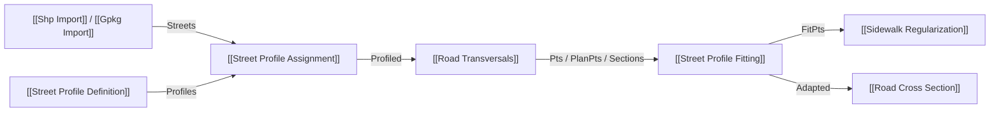

# Street Profile Assignment

Conecta perfis viários conceituais ([[Street Profile Definition]]) às feições reais de logradouros vindas de fontes GIS (SHP, GPKG ou curvas diretas). A atribuição é realizada por correspondência semântica de nome de rua (`StreetName` ↔ coluna configurável de atributos GIS), suportando múltiplos trechos por logradouro sem exigir que o usuário crie cópias manuais de perfis para cada segmento. Vias sem perfil compatível são sinalizadas como `UNMATCHED_STREET` e perfis conflitantes geram `AMBIGUOUS_PROFILE_MATCH` sem casamento silencioso.

## Inputs

| Nome | Nick | Tipo | Padrão | Função |
|---|---|---|---|---|
| Streets | Str | Generic list | — | Feições GIS / eixos de logradouros (Curvas, registros SHP/GPKG ou objetos de vias) |
| Street Profiles | Profiles | StreetProfile list | — | Coleção de perfis viários conceituais gerados por [[Street Profile Definition]] |
| Street Name Field | NameField | Text | vazio | Campo explícito do nome; vazio procura nomes conhecidos. Campo solicitado e ausente gera erro |
| Match Mode | Mode | Integer | `0` | Modo de casamento: `0` = Normalized (insensível a maiúsculas/minúsculas, trim e espaços múltiplos colapsados); `1` = Exact |
| Run | Run | Boolean | `true` | Executa o cálculo da pilha (último input estrito) |

## Outputs

| Nome | Nick | Tipo | Função |
|---|---|---|---|
| Profiled Streets | Profiled | ProfiledStreet list | Feições GIS acopladas com seu respectivo `StreetProfile`, preservando `StreetID`, `StreetName` e geometria |
| Matched Curves | Matched | Curve list | Eixos que encontraram exatamente um perfil correspondente |
| Unmatched Curves | Unmatched | Curve list | Eixos sem perfil (`UNMATCHED_STREET`), preservados para análise |
| Ambiguous Curves | Ambiguous | Curve list | Eixos com perfis concorrentes (`AMBIGUOUS_PROFILE_MATCH`) |
| Assignment Report | Report | Text | Resumo diagnóstico com contagens, status de casamento e divergências |

## 🔗 Conexões & Compatibilidade de Pilhas (Pills)

## Regras de Associação e Normalização

1. **Relação 1-para-N (Um perfil para múltiplos segmentos):** Um único `StreetProfile` com `StreetName = "Rua Amazonas"` associa-se automaticamente a todos os segmentos cadastrais cujo campo GIS corresponda a esse nome.
2. **Normalização Robusta (`Mode = 0`):** Remove espaços residuais nas extremidades, colapsa sequências de múltiplos espaços internos (`"Rua   Amazonas"` $\to$ `"Rua Amazonas"`) e compara em caixa alta insensível.
3. **Detecção de Ambiguidade:** Se dois ou mais perfis distintos possuírem o mesmo `StreetName`, as vias afetadas não são casadas silenciosamente; são emitidas em `Ambiguous` com o código `AMBIGUOUS_PROFILE_MATCH`.
4. **Acoplamento a Jusante:** `ProfiledStreet` alimenta `Axis` de [[Road Transversals]]. A saída tipada `Sections` transporta o perfil diretamente ao [[Street Profile Fitting]], sem novo matching por nome. `SectionMeta` e `Profile` continuam como ponte de compatibilidade. Desde 1.2.0, `Streets` também aceita `Features` de [[Shp Import]]/[[Gpkg Import]] e consulta `NameField` no mapa tipado de atributos da feição.
5. **Identidade:** Atributos GIS válidos (`STREET_ID`, `ID_LOGRADOURO`, `ID_LOG`, `COD_LOG`, `ID`, `FID`) geram `StreetID` de origem. Sem eles, um fingerprint de nome e geometria substitui o número de registro. O `id` do SHP real de Picuí contém asteriscos e é rejeitado.

## Ícone Vetorial Nativo
Possui ícone exclusivo 24×24 px desenhado via GDI+ vetorial em `GlauxUrbIcons.StreetProfileAssignment`, apresentando insígnia de perfil viário à esquerda, vetor de conexão central e eixo viário com limites públicos à direita, obedecendo à paleta canônica Glaux.
