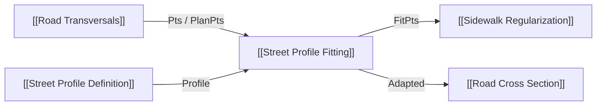

# Street Profile Definition

Componente semântico com inputs variáveis nativos do Grasshopper (`IGH_VariableParameterComponent`). Nasce com `Street`, `Street Type` e uma faixa `Road`. Cada input adicional representa uma faixa na ordem transversal **esquerda → direita**. O menu do componente define tipo, sentido, obrigatoriedade e movimento; `+`/`−` nativos inserem/removem faixas. Presets criam sequências sem larguras normativas. Cada parâmetro persiste seus próprios metadados semânticos e mantém seu GUID como `ElementID`; reordenação e remoção não dependem de lista paralela. A versão anterior de 21 inputs foi ocultada sob seu GUID original para arquivos `.gh` existentes.

## Inputs

| Nome | Nick | Tipo | Função |
|---|---|---|---|
| Street | Street | Text | Identidade da via; para GIS, usar `SourceStreetID` de `SectionMeta` |
| Street Type | StreetType | Text | Classificação global da via; não determina os tipos das faixas |
| Faixas variáveis | Nome do tipo | Generic item, 1+ | Intervalo GH ou texto `mínimo|máximo`; número significa largura fixa `[n,n]`. Tipo/direção/required pelo menu |

Tipos iniciais: Road, Lane, Sidewalk, Median, Pedestrian, Cycle Track, Parking, Tree Strip, Green Strip, Furniture Strip, Transit, Shoulder, Other. Arborização e mobiliário são função da faixa; objetos não são distribuídos aqui.

## Outputs

| Nome | Nick | Tipo | Função |
|---|---|---|---|
| Street Profile | Profile | StreetProfile object | Street, StreetType, Elements[] com `WidthDomain [Minimum,Maximum]` por faixa |
| Profile Elements | Elements | Text list | Prévia detalhada por faixa |
| Profile Preview | Preview | Text | Resumo esquerda → direita |

## 🔗 Conexões & Compatibilidade de Pilhas (Pills)

O `Street Profile` é o contrato nominal. `[[Street Profile Fitting]]` mede largura disponível e registra os elementos ajustados por seção. `PROFILE_TYPE_MISMATCH` aparece como warning e no Preview quando Street Type contradiz as faixas, sem corrigi-las automaticamente. Domínios sem conexão permanecem `[0,0]`, sem default normativo. Relatório: `docs/GLAUX_URB_WIDTH_DOMAIN_STREET_IDENTITY_2026-10-01.md`. Ícone próprio da família Glaux preservado. Teste do núcleo 18/18; serialização e UI no Rhino pendentes.
