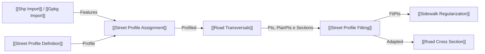

# Street Profile Fitting

Ajusta a sequência semântica às seções reais/adaptativas, preserva QL/QR e cada `ElementID`. Cada faixa ativa permanece dentro de seu `WidthDomain [Minimum,Maximum]`; uma faixa opcional só pode ficar abaixo do mínimo quando explicitamente `SUPPRESSED` (largura zero). Largura insuficiente gera `PROFILE_CONFLICT`; largura acima da soma dos máximos gera `EXCESS_WIDTH`, sem expandir faixas silenciosamente. O input de `PlanPts` conectado deve manter os limites dos lotes originais.

## Inputs

| Nome | Nick | Tipo | Função |
|---|---|---|---|
| Street Profiles | Profile | StreetProfile / ProfiledStreet list, optional | [[Street Profile Definition]].Profile ou [[Street Profile Assignment]].Profiled; opcional com `Sections` tipadas |
| Section Points | Pts | Point tree `{rua;estaca}`, cinco pontos, required | [[Road Transversals]].Pts: lote E, meio-fio E, centro, meio-fio D, lote D |
| Planned Section Points | PlanPts | Point tree `{rua;estaca}`, optional | [[Road Transversals]].PlanPts; QL/QR idênticos aos originais |
| Street Path Index | PathIdx | Integer | Posição temporária em `{rua;estaca}`; fallback manual para árvore multivia sem SectionMeta; não é identidade |
| Run | Run | Boolean | Executa |
| Section Metadata | SectionMeta | Text tree, optional | `SourceStreetID` / `StreetName` / `Profile` de [[Road Transversals]] para seleção automática por identidade |
| Profiled Sections | Sections | ProfiledSection tree `{rua;estaca}`, optional | [[Road Transversals]].Sections após ligar ProfileAssign.Profiled em Axis; evita novo matching |

## Outputs

| Nome | Nick | Tipo | Função |
|---|---|---|---|
| Adapted Profiles | Adapted | Text tree | Faixas internas do domínio viário por seção, com ID/status |
| Fitted Section Points | FitPts | Point tree | QL, meio-fio L, centro, meio-fio R, QR |
| Fitting Conflicts | Conflicts | Text tree | Déficit, `EXCESS_WIDTH`, lacuna de domínios, geometria ou mínimo interpolado |
| Fitted Street Profiles | Fitted | StreetProfile tree | Todos os elementos com ordem, largura e status |
| Fitting Report | Report | Text | Contagens e supressões |

## 🔗 Conexões & Compatibilidade de Pilhas (Pills)

Quando `Sections` está conectado, o fitting usa o `StreetProfile` embutido em cada seção e confere QL/QR contra `Pts`; seção sem perfil recebe `UNMATCHED_SECTION_PROFILE`. Sem `Sections`, aceita lista de `ProfiledStreet`/`StreetProfile` e usa `SectionMeta` como ponte textual de compatibilidade. O índice do caminho (`PathIdx`) é seleção temporária, não identidade. Ícone 24×24 px exclusivo em `GlauxUrbIcons.StreetProfileFitting`. O 3D atual reconhece faixas viárias internas; subdivisão de Tree Strip e Furniture Strip externas nas superfícies longitudinais segue pendente. Testes puros 24/24; validação geométrica interativa no Rhino/Grasshopper pendente.

Em 1º de outubro de 2026, a entrada genérica `Sections` passou a ser lida por `VolatileData` e ramos `IGH_Goo`. A conversão exigida por `GetDataTree<GH_ObjectWrapper>` causava breakpoint na abertura do Grasshopper quando a árvore conectada tinha o tipo genérico real. A correção preserva os caminhos `{rua;estaca}` e o perfil embutido.

Após instalar 1.1.1, o usuário reabriu o mesmo documento e confirmou ausência desse breakpoint. Essa verificação cobre a abertura do documento; resultados geométricos e demais interações ainda exigem teste próprio.

Em 1.2.0, tooltips e runtime messages passam a indicar as ligações necessárias. `Pts` vazio explica o formato esperado; `Sections` conectado sem `ProfiledSection` acusa o tipo errado; `Profile` sem `StreetProfile` mostra o tipo recebido; seções rejeitadas resumem os primeiros conflitos no componente. O fitting numérico manteve o algoritmo anterior. Teste isolado 32/32; canvas Rhino desta versão ainda não validado.

Em 2026-10-02, a definição real `picui.gh` mostrou que `Sections` estava ligada a `Assignment.Profiled` (`ProfiledStreet`), e não a `Road Transversals.Sections` (`ProfiledSection`); `Axis` recebia o importador bruto. A cópia corrigida está em `examples/picui-pipeline-corrigido.gh`. A mensagem de erro agora informa o tipo e a fonte recebidos. O fallback posicional de vários perfis para várias vias foi removido: número ou ordem de ramos não é identidade. O perfil único sem metadados só é aplicado automaticamente quando há uma única rua; em multivia, use `Sections` tipadas ou `SectionMeta` com ID. A ligação arquivada foi verificada no arquivo, mas a execução da cópia no canvas ainda requer Rhino/Grasshopper.
