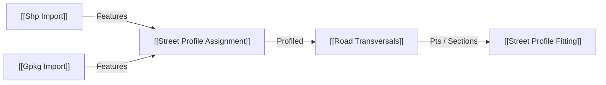

# GIS Import e Fitting UX — 2026-10-01

Auditoria local e `git fetch` confirmaram versão 1.1.1 sincronizada antes da edição. `ShpImport` e `GpkgImport` misturavam nomes/valores em `Attrs`, embora os leitores já usassem `ShpFeature` com dicionário tipado. Mantivemos essa saída para definições antigas e acrescentamos `Attributes` (`Values`) por `{feição}` na ordem explícita de `Fields`, `Geometry by Feature`, `Features` e `CRS`. `Street Profile Assignment` passa a receber `Features` diretamente.

No SHP, `.cpg` e LDID reconhecido substituem o Windows-1252 fixo; override manual tem prioridade e `EncInfo` declara a fonte. Registros DBF excluídos preservam o slot e evitam troca silenciosa de atributos entre geometrias. GeoPackage mantém UTF-8 explícito, inclusive nomes de campos e caminhos. O fitting não teve o algoritmo numérico refeito: os testes apontaram funcionamento de mínimos, máximos e IDs; o contrato de entrada e as mensagens foram esclarecidos. Os testes isolados passaram; a validação interativa da versão 1.2.0 no Rhino/Grasshopper permanece pendente.

Relatório técnico: `docs/GLAUX_URB_GIS_IMPORT_PROFILE_FITTING_2026-10-01.md`.
